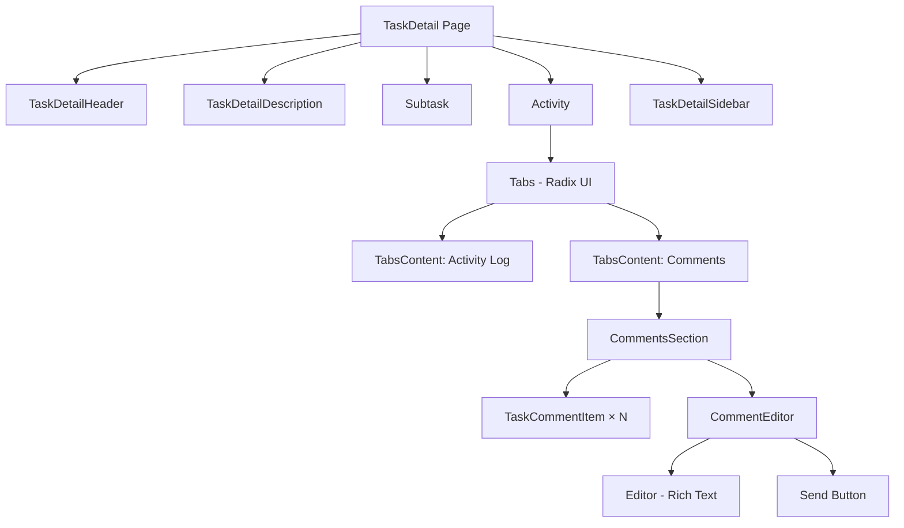
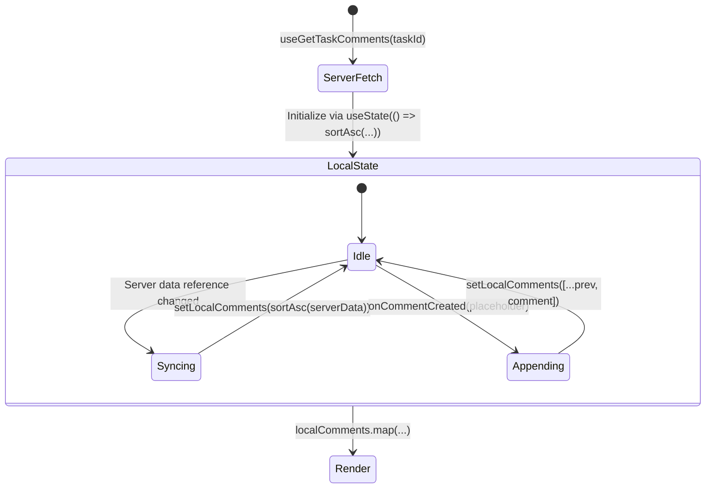
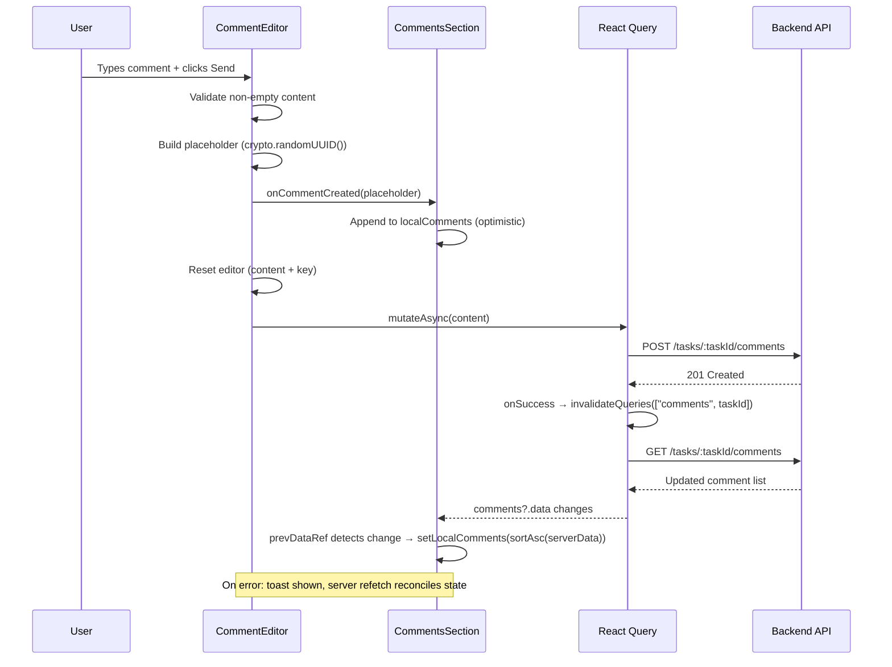
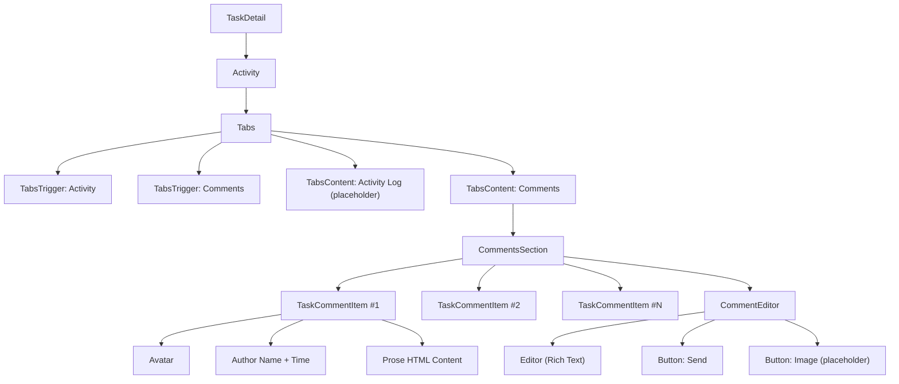
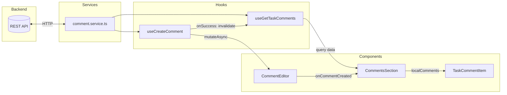

# KAN-60: Task Comments & Activity Section

## 1. Overview

### Summary

This feature adds a **Comments tab** within a new **Activity section** on the Task Detail page. Users can view existing comments in chronological order and create new comments with rich-text content. Comments appear instantly via optimistic updates and are sanitized against XSS before rendering.

### Problem It Solves

- **No collaboration context on tasks** — team members had no way to discuss a task, ask questions, or leave notes directly on the task detail page.
- **No activity visibility** — the task detail page showed only the task's current state with no history or communication trail.

---

## 2. Architecture & Design

### High-Level Structure

The feature introduces a tabbed Activity section at the bottom of the Task Detail page. The tabs use Radix UI primitives (via shadcn/ui) and currently expose two panels: **Activity** (placeholder) and **Comments** (fully implemented).



### Integration Points

| Module | Integration |
|---|---|
| `TaskDetail` (page) | Renders `<Activity taskId={task.id} />` below the subtask list |
| `@tanstack/react-query` | `useQuery` for fetching, `useMutation` for creating comments |
| `Zustand` (`useStoreUser`) | Provides current user data for optimistic comment placeholders |
| `sonner` | Toast notifications for error feedback |
| `DOMPurify` | Sanitizes HTML before rendering in `dangerouslySetInnerHTML` |
| `@tailwindcss/typography` | `prose` classes for rendering rich-text comment content |

---

## 3. Technical Decisions

### 3.1 Optimistic Updates via Local State + Server Sync

**Decision:** Maintain a `localComments` state array that is seeded from server data and updated optimistically on comment creation.

**Reasoning:** The comment list needs to show new comments instantly without waiting for a network round-trip. TanStack Query's built-in optimistic mutation support (`onMutate` / `onError` / `onSettled`) requires writing cache manipulation logic. Instead, we keep a local copy that:
1. Initializes from server data
2. Syncs when server data changes (via `prevDataRef` pattern)
3. Appends optimistic entries immediately on creation

**Trade-offs:**
- Simpler than cache-level optimistic updates
- Slight duplication of server state in local state
- Server re-fetch via query invalidation (`onSuccess`) reconciles any drift

**Alternative considered:** Pure TanStack Query cache manipulation with `queryClient.setQueryData` in `onMutate`. Rejected due to added complexity for a simple append operation — the local state approach is more readable and sufficient for this use case.

### 3.2 DOMPurify for XSS Sanitization

**Decision:** Sanitize comment HTML with DOMPurify before rendering via `dangerouslySetInnerHTML`.

**Reasoning:** Comments contain rich-text HTML from the editor. If a malicious user injects `<script>` tags or `onerror` handlers, they would execute in every viewer's browser (stored XSS). DOMPurify is the industry-standard allowlist-based sanitizer that strips dangerous content while preserving safe markup.

**Alternative considered:** Rendering a safe rich-text representation (e.g., re-parsing HTML into React elements). Rejected because it would duplicate what the `prose` typography classes already handle, and DOMPurify is a well-tested, minimal-overhead solution.

### 3.3 `prevDataRef` Pattern (setState During Render)

**Decision:** Sync server data to local state using the render-time `prevDataRef` pattern instead of `useEffect`.

**Reasoning:** This is the [React-recommended approach](https://react.dev/reference/react/useState#storing-information-from-previous-renders) for adjusting state based on changed props/data. Unlike `useEffect`, it avoids an extra commit cycle (render → effect → re-render) and the associated visual flicker. React handles it by restarting the render immediately.

**Alternative considered:** `useEffect` with `subtasks?.data` as a dependency. Rejected because calling `setState` inside an effect triggers cascading renders and a React warning in strict mode.

### 3.4 `useQueryClient()` Over Global Import

**Decision:** All mutation hooks use `useQueryClient()` instead of importing the global `queryClient` instance.

**Reasoning:** Using the context-provided client ensures invalidation is scoped to the active `QueryClientProvider`, making hooks testable without needing to mock the global module.

---

## 4. Implementation Details

### Component Structure

```
src/
├── components/
│   ├── TaskComment/
│   │   ├── editor.tsx          # Rich-text editor + submit button
│   │   ├── item.tsx            # Single comment display
│   │   └── hooks/
│   │       └── use-create-comment.ts
│   └── ui/
│       └── tabs.tsx            # shadcn/ui Tabs (Radix)
├── features/
│   └── TaskDetail/
│       └── activity/
│           ├── index.tsx       # Tabs container (Activity / Comments)
│           ├── comments.tsx    # Comments list + local state management
│           ├── hooks/
│           │   └── use-get-task-comments.ts
│           └── tests/
│               └── comment.test.tsx
├── services/
│   └── comment.service.ts     # HTTP layer (GET, POST, PUT)
└── types/
    ├── comment.type.ts         # IComment, ICommentDto
    └── common.type.ts          # IResponse<T>, IResponseMeta
```

### State Management



**Key patterns:**
- **Lazy initializer:** `useState(() => sortAsc(...))` — avoids sorting on every render, only runs once on mount.
- **Functional setState:** `setLocalComments((prev) => [...prev, comment])` — avoids stale closure issues.
- **Module-level `sortAsc`:** Defined outside the component to avoid recreation on every render.

### API Integration



**Endpoints:**

| Method | Path | Description |
|---|---|---|
| `GET` | `/tasks/:taskId/comments` | Fetch all comments for a task |
| `POST` | `/tasks/:taskId/comments` | Create a new comment |
| `PUT` | `/tasks/:taskId/comments/:commentId` | Update an existing comment (wired, not yet used in UI) |

### Important Logic

**Optimistic Comment Flow (`editor.tsx`):**

1. Validate content is non-empty (`!content.trim()` guard)
2. Build a placeholder `IComment` with `crypto.randomUUID()` as temporary ID
3. Fire `onCommentCreated(placeholder)` immediately (instant UI feedback)
4. Reset editor state (clear content, increment `editorKey` to remount Editor)
5. `await createComment(content)` — actual API call
6. On success: query invalidation replaces optimistic entry with server data
7. On error: `toast.error(...)` — server refetch reconciles the list

**XSS Sanitization (`item.tsx`):**

```tsx
dangerouslySetInnerHTML={{ __html: DOMPurify.sanitize(content) }}
```

DOMPurify strips `<script>`, event handlers (`onerror`, `onclick`), `javascript:` URIs, and other XSS vectors while preserving safe tags (`<p>`, `<h1>`, `<strong>`, `<ul>`, etc.).

---

## 5. Diagrams

### Component Hierarchy



### Data Flow



---

## 6. Performance Considerations

### Optimizations Applied

| Technique | Where | Impact |
|---|---|---|
| Lazy `useState` initializer | `comments.tsx` | `sortAsc()` only runs once on mount, not every render |
| Module-level `sortAsc` | `comments.tsx` | No function allocation per render |
| `editorKey` remount pattern | `editor.tsx` | Cleanly resets the rich-text Editor without imperative ref calls |
| `isPending` disabled button | `editor.tsx` | Prevents duplicate API requests during submission |
| React Compiler (project-wide) | All components | Automatic memoization — no manual `useMemo`/`useCallback` needed per CLAUDE.md |
| Scoped query keys | `["comments", taskId]` | Invalidation only affects the specific task's comment list |

### Potential Bottlenecks

- **`DOMPurify.sanitize` on every render** — Parses the full HTML string each time `TaskCommentItem` re-renders. For large comment lists, this could add up. The React Compiler should memoize this when `content` hasn't changed, but if profiling reveals issues, consider pre-sanitizing on the server or caching sanitized output.
- **`sortAsc` with `new Date()` on each comparison** — For very large comment lists (hundreds+), the repeated date parsing could be measurable. Could be optimized with a single-pass timestamp extraction, but unlikely to matter at current scale.
- **No virtualization** — All comments render in the DOM simultaneously. For tasks with 100+ comments, a virtualized list (e.g., `@tanstack/virtual`) would improve initial render time.

---

## 7. Edge Cases & Limitations

### Handled

| Edge Case | Handling |
|---|---|
| Empty comment submission | `!content.trim()` guard prevents empty API calls |
| XSS in comment content | DOMPurify sanitizes all HTML before rendering |
| Duplicate optimistic keys | `crypto.randomUUID()` generates unique IDs per placeholder |
| Double-click submit | `isPending` disables the Send button during API call |
| Server returns unsorted data | `sortAsc` normalizes to chronological order on every sync |
| Author name with extra spaces | `.filter(Boolean)` in initials derivation handles double spaces |
| Missing author name | Falls back to `"U"` for avatar, `"User avatar"` for alt text |
| API error on create | Toast error shown; server refetch reconciles the list |

### Known Limitations

- **No optimistic rollback on error** — If the create API fails, the optimistic comment remains in the list until the next server refetch (triggered by `onSuccess` query invalidation, which won't fire on error). The `onSettled` callback would be more robust here to ensure refetch on both success and failure.
- **No edit/delete UI** — `updateComment` is wired in the service layer but not exposed in the UI.
- **No pagination** — All comments are fetched in a single request. The `IResponse<T>` type includes `meta` with pagination fields, but the UI doesn't use them yet.
- **Activity tab is a placeholder** — The "Activity" tab renders static text; no activity log implementation exists.
- **No real-time updates** — Comments from other users won't appear until the query's stale time triggers a refetch or the user navigates away and back.
- **Image upload button is non-functional** — The ImagePlus button is rendered but has no handler.

---

## 8. Future Improvements

### Short-Term

- **Add `onSettled` to `useCreateComment`** — Ensure query invalidation fires on both success and error, removing stale optimistic entries on failure.
- **Implement edit/delete** — The `updateComment` service function exists; add inline editing with an "edited" indicator using `is_edited`.
- **Wire image uploads** — Connect the ImagePlus button to a file upload flow that embeds images in comment content.

### Medium-Term

- **Pagination / infinite scroll** — Use `useInfiniteQuery` with the existing `IResponseMeta` pagination fields to handle tasks with many comments.
- **Activity log** — Implement the Activity tab with a timeline of task changes (status changes, assignee updates, label modifications).
- **Real-time comments** — Integrate WebSocket or Server-Sent Events to push new comments to all viewers without polling.

### Long-Term

- **Comment threading / replies** — Support nested replies to enable focused discussions within a task.
- **@mentions** — Tag team members in comments with notifications.
- **Reactions** — Lightweight emoji reactions on comments for quick feedback.
- **Virtualized comment list** — Adopt `@tanstack/virtual` for tasks with high comment volume.

---

## Appendix: New Dependencies

| Package | Version | Purpose |
|---|---|---|
| `dompurify` | `^3.3.3` | XSS sanitization for user-generated HTML |
| `@tailwindcss/typography` | `^0.5.19` | `prose` classes for rendering rich-text content with proper heading/list/paragraph styles |

## Appendix: Test Coverage

**File:** `src/features/TaskDetail/activity/tests/comment.test.tsx`

| Category | Tests |
|---|---|
| Rendering | Renders all comments, sorts by `created_at` ascending, renders editor |
| Optimistic creation | Appends at bottom, preserves existing order, supports sequential additions |
| **Total** | **6 tests** |
