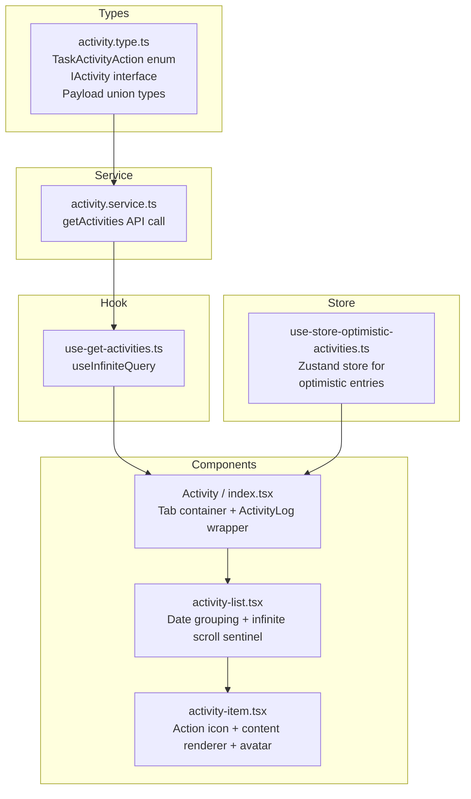
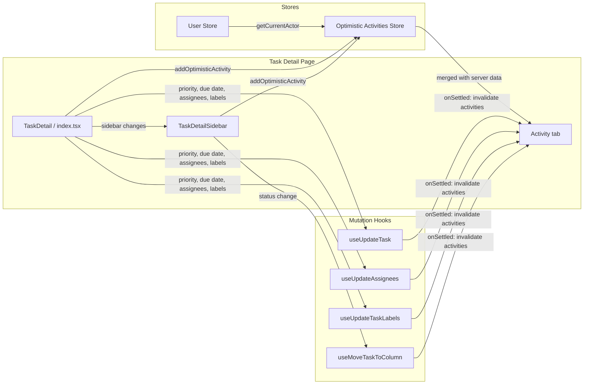
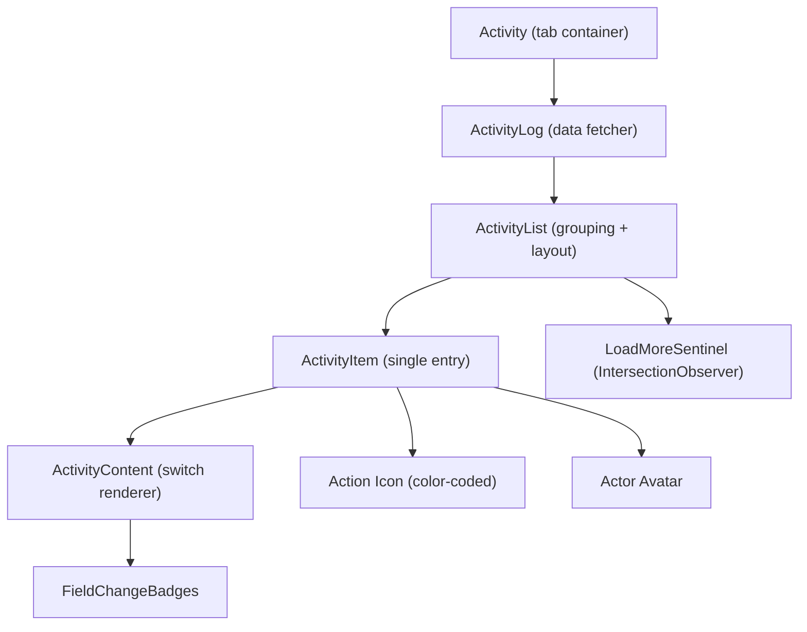
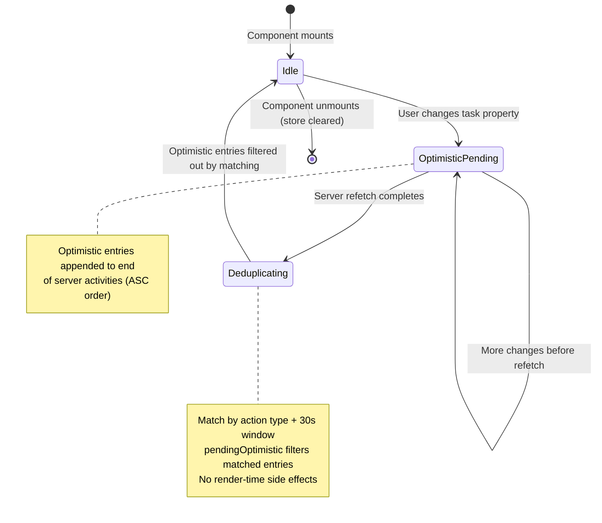
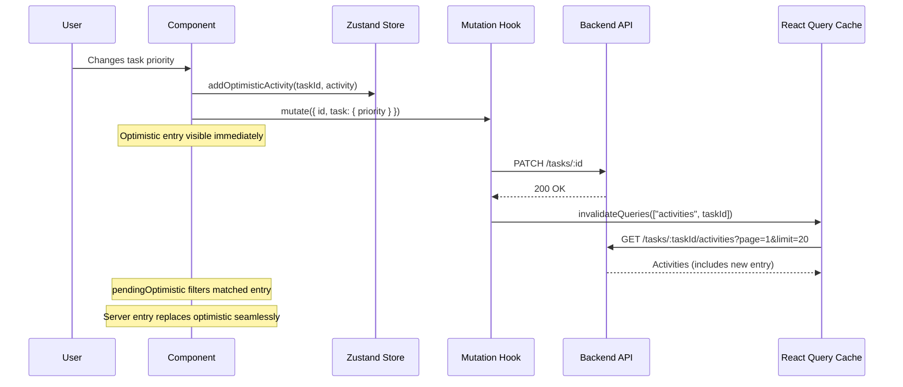
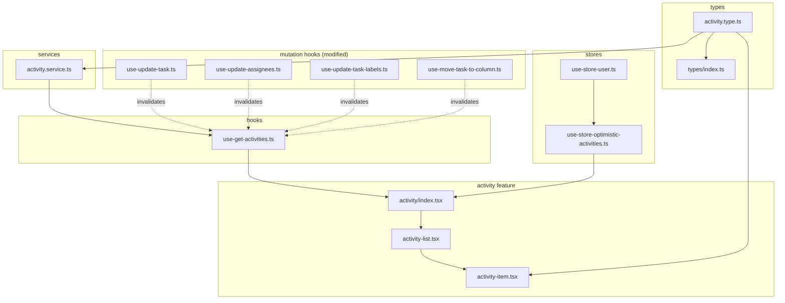
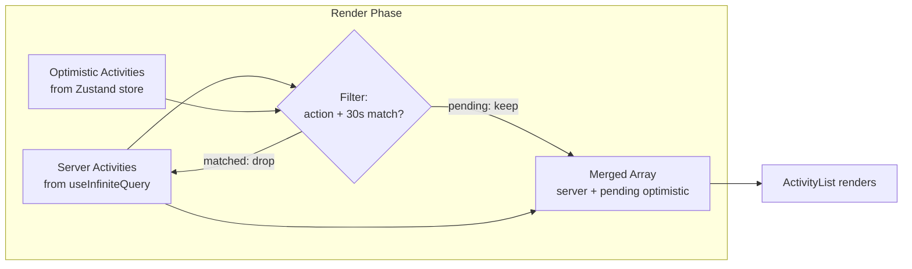
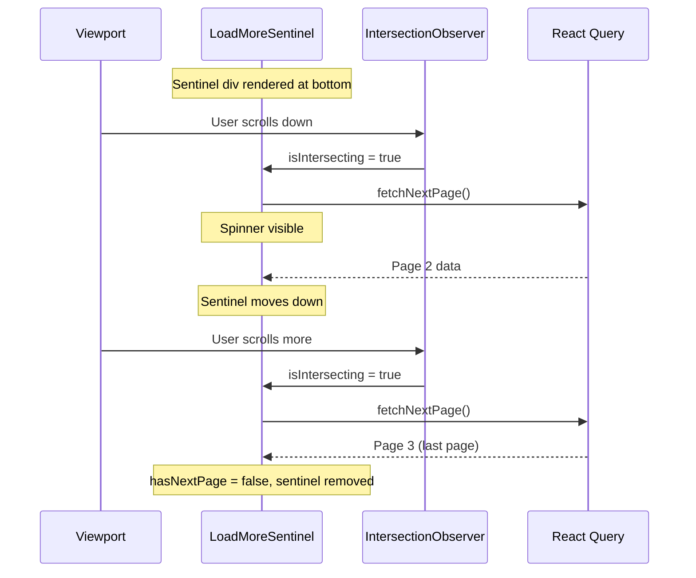

# Task Activity Log — Technical Document

## 1. Overview

### Summary

The Task Activity Log provides an immutable audit trail of all actions performed on a task — status changes, assignee updates, label modifications, priority changes, due date adjustments, and more. It renders as a color-coded vertical timeline in the Activity tab of the task detail view, with infinite scroll pagination and optimistic updates.

### Problem It Solves

Before this feature, users had no visibility into the history of changes on a task. When a task's status or assignee changed, there was no record of who made the change, when, or what the previous value was. This made it difficult to track accountability, debug workflow issues, or understand the full context of a task's evolution.

---

## 2. Architecture & Design

### High-Level Structure

The feature follows the existing codebase pattern: **Types → Service → Hook → Components**.

### Integration with Existing Modules

---

## 3. Technical Decisions

### Key Decisions

| Decision | Rationale |
|----------|-----------|
| **`useInfiniteQuery` over `useQuery`** | Activities are append-only and sorted oldest-first. Infinite scroll with `IntersectionObserver` is the natural UX pattern — users scroll down to see more history without pagination controls. |
| **Zustand for optimistic state** | React Query's built-in optimistic updates (`onMutate` → cache manipulation) would require modifying the infinite query cache structure (pages array), which is complex and error-prone. A separate Zustand store keeps optimistic entries independent, merged at render time. |
| **`as const` enum pattern** | Matches existing `NotificationType` pattern. Avoids TypeScript `enum` keyword due to `erasableSyntaxOnly` in tsconfig. |
| **Switch-based `ActivityContent`** | Same pattern as `NotificationContent`. 12 cases in one component is manageable. Co-location keeps all renderers discoverable. |
| **`Map` for date grouping** | `Map` preserves insertion order, matching the API's ASC sort. No client-side re-sorting needed. |
| **`IntersectionObserver` sentinel** | Auto-loads next page when user scrolls to bottom. 100px `rootMargin` triggers early for seamless loading. More natural than a manual "Load more" button. |
| **30-second dedup window** | Optimistic entries are matched against server entries by `action type + 30s time proximity`. Simpler than ID-based matching (optimistic entries don't have server IDs). |
| **Unmount-only store cleanup** | `clearForTask` is not called during render (would cause infinite loops with Zustand's external store). Instead, `pendingOptimistic` filtering handles the UI, and the store is cleaned on unmount. |
| **`getCurrentActor()` from Zustand `getState()`** | Actor info is needed in event handlers (non-React context). `getState()` reads synchronously without hooks. Eliminates duplicated actor construction across components. |

### Alternatives Considered

| Alternative | Why Rejected |
|-------------|-------------|
| React Query `onMutate` optimistic updates | Requires direct manipulation of infinite query page cache — fragile when pages are added/removed. Zustand store is simpler and decoupled. |
| Polling instead of invalidation | Polling wastes bandwidth when no changes occur. Targeted invalidation via mutation `onSettled` callbacks is more efficient. |
| WebSocket for real-time updates | Adds infrastructure complexity. Invalidation-based refetch is sufficient for single-user task detail views. Can be added later. |
| Virtual list for activity rendering | Activity lists are typically <100 items per task. DOM overhead is negligible. Virtualization adds complexity without measurable benefit. |

---

## 4. Implementation Details

### Component Structure

| Component | Responsibility |
|-----------|---------------|
| `Activity` | Tab container, manages active tab state, comment deep-link routing |
| `ActivityLog` | Data orchestration — fetches server data, reads optimistic store, merges and deduplicates |
| `ActivityList` | Groups activities by date (Today/Yesterday/date), renders sections, manages infinite scroll sentinel |
| `LoadMoreSentinel` | IntersectionObserver-based trigger that calls `onLoadMore` when scrolled into view |
| `ActivityItem` | Renders a single activity: color-coded action icon, actor avatar, content, timestamp |
| `ActivityContent` | Switch on `action` type — renders type-specific content (badges, user names, label pills) |
| `FieldChangeBadges` | Reusable from/to badge pair with arrow, used by status, priority, and due date changes |

### State Management

**Two state layers:**

1. **Server state** (TanStack Query) — `useInfiniteQuery` with `["activities", taskId]` query key. Paginated, 20 items per page.
2. **Optimistic state** (Zustand) — `Map<taskId, IActivity[]>`. Entries are appended on user actions, filtered during render merge, cleared on unmount.

### API Integration

**Endpoint:** `GET /api/tasks/:taskId/activities`

| Parameter | Type | Default | Description |
|-----------|------|---------|-------------|
| `page` | number | 1 | Page number (1-based) |
| `limit` | number | 20 | Items per page (max 100) |
| `action` | TaskActivityAction | — | Optional filter by action type |

**Response:** Paginated `IResponse<IActivity[]>` sorted by `created_at ASC`.

### Activity Invalidation Matrix

Each mutation hook invalidates both `["board"]` and `["activities", taskId]`:

| Hook | Trigger | Query Invalidated |
|------|---------|-------------------|
| `useUpdateTask` | Priority, due date, title, description | `["activities", id]` |
| `useUpdateAssignees` | Assignee add/remove | `["activities", id]` |
| `useUpdateTaskLabels` | Label add/remove | `["activities", id]` |
| `useMoveTaskToColumn` | Status/column change | `["activities", id]` |

### Action Type Visual Map

Each of the 12 action types has a distinctive icon and color:

| Action | Icon | Color | Content |
|--------|------|-------|---------|
| `task_created` | Plus | Emerald | "{name} created this task" |
| `task_title_updated` | Type | Sky | "{name} updated the title" |
| `task_description_updated` | FileText | Slate | "{name} updated task description" |
| `task_status_changed` | ArrowRightLeft | Indigo | "{name} changed status from [from] → [to]" |
| `task_priority_changed` | ShieldAlert | Rose | "{name} changed priority from [from] → [to]" |
| `task_due_date_changed` | CalendarDays | Amber | "{name} changed the due date [from] → [to]" |
| `task_assignee_added` | UserPlus | Teal | "{name} assigned this to {users}" |
| `task_assignee_removed` | UserMinus | Orange | "{name} unassigned {users}" |
| `task_label_added` | Tag | Violet | "{name} added label {badges}" |
| `task_label_removed` | Tags | Pink | "{name} removed label {badges}" |
| `task_moved` | ArrowRightLeft | Cyan | "{name} moved this task to another column" |
| `task_reordered` | GripVertical | Gray | "{name} reordered this task" |

Priority badges use colors matching the `PRIORITY_OPTIONS` constant (urgent=red, high=orange, medium=yellow, low=blue). Label badges use the label's actual `color` field from the API.

---

## 5. Diagrams

### File Dependency Graph

### Optimistic Update Data Flow

### Infinite Scroll Lifecycle

---

## 6. Performance Considerations

### Optimizations Used

| Technique | Where | Impact |
|-----------|-------|--------|
| `EMPTY_ACTIVITIES` stable reference | `ActivityLog` Zustand selector | Prevents infinite re-render from `?? []` creating new array each call |
| `IntersectionObserver` with `rootMargin: "100px"` | `LoadMoreSentinel` | Pre-fetches next page before user reaches bottom, eliminating perceived latency |
| `useInfiniteQuery` page accumulation | `use-get-activities.ts` | Only fetches new pages, doesn't re-fetch all previous pages |
| Unmount-only store cleanup | `ActivityLog` useEffect return | Avoids render-time side effects that cause loops with Zustand's external store |
| `Map` for date grouping | `groupByDate` | O(n) single pass, preserves API sort order, no re-sorting |
| CSS-based timeline connector hiding | `.activity-group > div:last-child` | No JS index tracking or prop passing needed |

### Potential Bottlenecks

| Concern | Severity | Mitigation |
|---------|----------|------------|
| Large activity lists (>500 items) | Low | Paginated at 20/page. Only rendered pages are in DOM. Consider virtualization if tasks routinely exceed 500 activities. |
| Optimistic dedup `O(optimistic * server)` | Negligible | Typically <5 optimistic entries and <100 server entries per page. |
| `new Date()` in dedup filter | Negligible | Called per filter iteration but on small arrays. |
| Multiple `invalidateQueries` calls per mutation | Low | Two invalidations per mutation (`board` + `activities`). React Query batches these efficiently. |

---

## 7. Edge Cases & Limitations

### Edge Cases Handled

| Edge Case | How It's Handled |
|-----------|-----------------|
| Empty payload arrays (`users`, `labels`) | `?? []` fallback on all array accesses from `as` casts |
| Missing label `color` on removed labels | Falls back to `#94a3b8` (slate gray) |
| Rapid same-type changes within 30s | Dedup may match wrong entry, but self-corrects on next refetch |
| Component unmount during pending optimistic | `useEffect` cleanup calls `clearForTask` |
| Empty activity list | Dedicated empty state with icon and message |
| `Zustand getSnapshot` infinite loop | `EMPTY_ACTIVITIES` module-level constant ensures stable reference |

### Known Limitations

| Limitation | Impact | Workaround |
|------------|--------|------------|
| 30-second dedup window is time-based, not ID-based | Two identical action types within 30s may cross-match | Self-corrects on refetch. V2 could use server-assigned correlation IDs. |
| No real-time updates from other users | Activity list only updates on page refetch or current user's mutations | Future: WebSocket integration to push activities from other users. |
| Optimistic entries don't survive page navigation | Zustand store cleared on unmount | Acceptable — server data loads on return. |
| No action type filter in UI | All 12 types always shown | API supports `action` query param. UI filter can be added later. |
| `task_moved` doesn't show column names | Only shows "moved to another column" | Backend payload has `from_column_id` / `to_column_id` as numbers. Would need column name resolution. |

---

## 8. Future Improvements

### Short Term

- **Action type filter dropdown** — API already supports `?action=task_status_changed`. Add a filter UI in the activity tab header.
- **Column name resolution** for `task_moved` — Map `column_id` to column name using the board data already in the React Query cache.
- **Correlation IDs** for optimistic dedup — Backend returns a `correlation_id` that the frontend sends with mutations, enabling exact matching instead of time-window heuristics.

### Medium Term

- **WebSocket real-time updates** — Push new activities to the client when other users make changes. Would subscribe to a `task:{taskId}:activities` channel.
- **Activity diff viewer** — For `task_description_updated`, show a rich diff of what changed (requires backend to store before/after snapshots).
- **Expandable detail** — Click an activity to see the full payload (e.g., all labels in a batch, exact column names).

### Scalability Considerations

- **Virtual list** — If tasks routinely exceed 500 activities, replace the flat list with `@tanstack/react-virtual` to only render visible items.
- **Activity aggregation** — Group consecutive same-actor activities into a single entry (e.g., "Grace Bui made 3 changes") to reduce visual noise on heavily-edited tasks.
- **Stale-while-revalidate** — Add `staleTime` to `useGetActivities` to reduce unnecessary refetches when switching between tabs.

---

## Files Changed

| File | Change | Lines |
|------|--------|-------|
| `src/types/activity.type.ts` | **New** | 90 |
| `src/types/index.ts` | Modified | +1 |
| `src/services/activity.service.ts` | **New** | 14 |
| `src/features/TaskDetail/activity/hooks/use-get-activities.ts` | **New** | 17 |
| `src/stores/use-store-optimistic-activities.ts` | **New** | 49 |
| `src/features/TaskDetail/activity/activity-item.tsx` | **New** | 274 |
| `src/features/TaskDetail/activity/activity-list.tsx` | **New** | 88 |
| `src/features/TaskDetail/activity/index.tsx` | Modified | +44 |
| `src/features/TaskDetail/index.tsx` | Modified | +50 |
| `src/features/TaskDetail/task-detail-sidebar/index.tsx` | Modified | +10 |
| `src/features/KanbanBoard/hooks/use-update-task.ts` | Modified | +2 |
| `src/components/AssigneeDropdown/hooks/use-update-assignees.ts` | Modified | +2 |
| `src/features/TaskDetail/hooks/use-update-task-labels.ts` | Modified | +2 |
| `src/features/KanbanBoard/hooks/use-move-task-to-column.ts` | Modified | +2 |
| `src/index.css` | Modified | +5 |
| `src/features/TaskDetail/activity/tests/activity-item.test.tsx` | **New** | 177 |
| `src/features/TaskDetail/activity/tests/activity-list.test.tsx` | **New** | 81 |

**Test coverage:** 19 new tests (14 for ActivityItem, 5 for ActivityList) — all 174 project tests passing.
