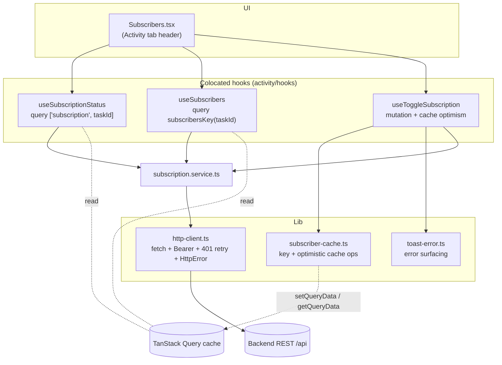
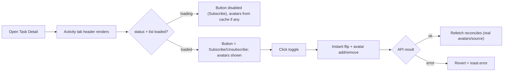
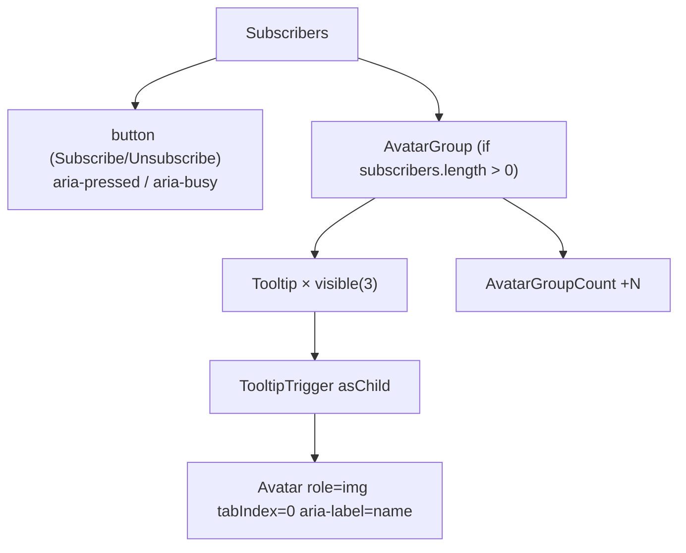
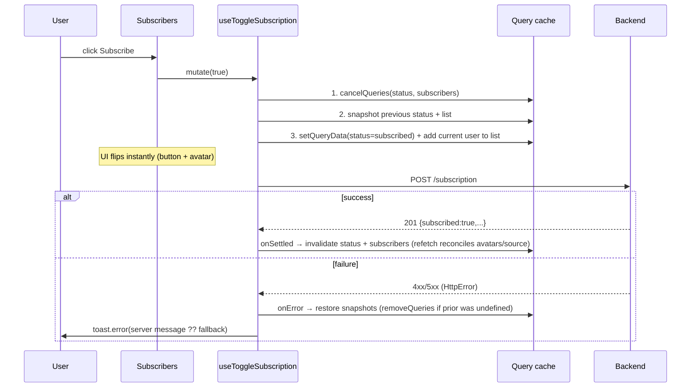
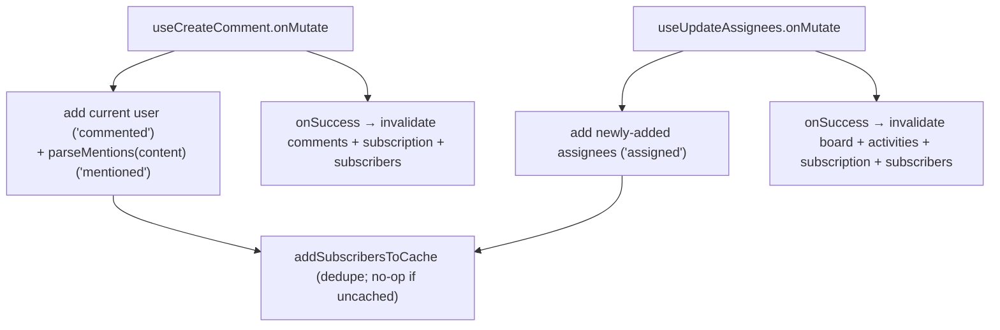
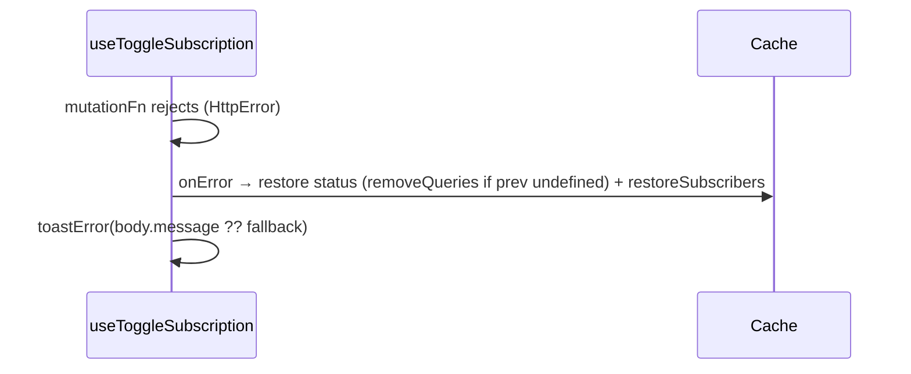

# Task Subscriptions (Watchers) — Frontend Technical Documentation

> **Feature:** Task subscriptions / watchers (KAN-78)
> **Stack:** React 19 · TypeScript · Vite 7 · TanStack Router + Query v5 · Zustand · Tailwind v4 + shadcn/ui
> **Status:** Implemented. Client-only (no backend in this repo). Single source of truth for the feature.

This document is written for frontend engineers who will maintain, debug, or extend the feature. It explains **what** the feature does and **why** it is built the way it is — the architectural decisions, tradeoffs, and the non-obvious details (optimistic-cache mechanics, error surfacing, accessibility).

---

## 1. Feature Overview

### Purpose
Let a user **subscribe** ("watch") a task so they receive notifications about future activity on it (comments, mentions, assignments, status changes), and show **who else is watching**. The control lives in the **Activity tab header** of the Task Detail view.

### Problem it solves
Before this feature there was no way to opt into a task's activity or see who is following it. Notifications only reached hard-wired recipients. Subscriptions make "who gets notified" explicit and user-controllable, and make watchers visible.

### Business requirements
- A user can subscribe/unsubscribe from a task manually.
- Certain actions **auto-subscribe** users server-side (no explicit FE call): creating the task (creator), being assigned, being `@mentioned` in a comment or description, and commenting.
- The UI shows the current user's subscription state and the list of subscribers.
- Removing an assignee does **not** unsubscribe them (subscriptions persist until explicit unsubscribe).

### Main user journeys
1. **Toggle subscription** — open a task → Activity tab → click **Subscribe/Unsubscribe**. The button flips and the avatar list updates immediately.
2. **See watchers** — the stacked avatars next to the button; hover/focus an avatar to see the person's name; `+N` overflow when there are more than 3.
3. **Auto-subscribe feedback** — after commenting / self-assigning, the current user appears in the watcher list without a manual toggle.

### User stories
- *As a user, I can watch a task so I get notified about its activity.*
- *As a user, I can stop watching a task.*
- *As a user, I can see who is watching a task.*
- *As a user, when I comment on or get assigned to a task, I start watching it automatically.*

### Assumptions
- The backend owns subscription truth and the auto-subscribe rules. The FE mirrors state and issues explicit subscribe/unsubscribe calls.
- The current user identity is available client-side via the persisted Zustand user store (`useStoreUser`).
- REST wire format is `snake_case`.

### Non-goals
- Managing **other** users' subscriptions (you can only toggle your own).
- Notification rendering/delivery — that is the **notifications** feature (REST + Socket.IO). Subscriptions only change *who* those notifications reach.
- Pagination of the subscriber list (assumed small).
- Optimistic reflection of **description-field** `@mentions` (see §19).

### Success metrics (indicative)
- % of active tasks with ≥1 subscriber; manual subscribe/unsubscribe rate; reduction in "I didn't know that changed" support pings. (Not instrumented in this repo — see §17.)

---

## 2. Frontend Architecture

### High-level
The feature is a thin, **cache-first** slice of server state: four REST endpoints → four service functions → three colocated TanStack Query hooks → one presentational component. There is **no Zustand store** for subscriptions; the TanStack Query cache is the single source of truth, and optimistic updates are written directly into it.



### Why this architecture
- **Cache-as-source-of-truth (no Zustand).** Subscriptions are read in exactly one place (the `Subscribers` component). There is no need for a mutable shared working copy, so a Zustand mirror would be pure overhead. TanStack Query already provides caching, dedup, invalidation, and native optimistic updates (`onMutate`/`onError`/`onSettled`). This contrasts with the **board**, which keeps a Zustand mirror because it is imperatively mutated by drag-and-drop and read by many components (see §22 FAQ).
- **Colocation.** Query/mutation hooks live next to the feature (`features/TaskDetail/activity/hooks/`); cross-cutting cache primitives live in `src/lib/` so shared components (`AssigneeDropdown`, `TaskComment`) can reuse them without importing *from* a feature.
- **Thin services.** `services/*.service.ts` are one-line typed `httpClient` calls with no React/Query/state — trivially testable and mockable.

### Tradeoffs / alternatives considered
| Decision | Alternative | Why chosen |
|---|---|---|
| Cache-based optimism | Zustand mirror (like the board) | One reader, no imperative mutation → mirror is redundant; cache optimism is less code and self-reconciling. |
| Optimism in the mutation hook (`onMutate`) | Optimism in the calling component (like assignees) | Subscriptions have no store the component owns; the hook is the natural owner of the cache write. |
| Shared cache helper in `src/lib` | Helper colocated in the feature | `AssigneeDropdown` + `TaskComment` (reusable components, used on the board too) must write the subscriber cache; importing from a feature would couple them backwards. |
| `@mention` optimism parses editor HTML | Rely on refetch only | Immediate feedback for the common comment path; description mentions left to refetch (lower value, awkward path — see §19). |

### Module boundaries & folder structure
```text
src/
  features/TaskDetail/activity/
    subscribers.tsx                  # the UI (presentational)
    index.tsx                        # Activity tab; renders <Subscribers taskId={...} />
    hooks/
      use-subscription-status.ts     # query: current user's status
      use-subscribers.ts             # query: subscriber list
      use-toggle-subscription.ts     # mutation: subscribe/unsubscribe (+ optimism)
  services/
    subscription.service.ts          # 4 REST calls
  lib/
    subscriber-cache.ts              # query key + optimistic cache ops (shared)
    toast-error.ts                   # server-message error toast (shared)
    http-client.ts                   # fetch wrapper (shared, pre-existing)
  types/
    subscription.type.ts             # domain types (barreled via @/types)
  components/
    TaskComment/parse-mentions.ts    # @mention extraction for optimism
    TaskComment/hooks/use-create-comment.ts   # cross-feature auto-subscribe
    AssigneeDropdown/hooks/use-update-assignees.ts  # cross-feature auto-subscribe
```

### Shared vs feature-specific
- **Feature-specific:** `subscribers.tsx`, the three `activity/hooks/*`.
- **Shared (`src/lib`):** `subscriber-cache.ts`, `toast-error.ts` — consumed by cross-feature mutations.
- **Reusable components that participate:** `AssigneeDropdown`, `TaskComment` (write the subscriber cache on their own mutations).

### Context providers
The feature adds **no new provider**. It relies on the app-wide `QueryClientProvider` (in `routes/__root.tsx`) and `TooltipProvider`.

---

## 3. UI Flow & User Journey

There is a single surface: the **Subscribers control** in the Activity tab header.



**States for the control:**
| State | Behavior |
|---|---|
| Loading (status) | Button disabled, label defaults to `Subscribe` (`isSubscribed = status?.subscribed ?? false`). |
| Empty (no subscribers) | Avatar group is not rendered (`subscribers.length > 0` guard); only the button shows. |
| Success | Label reflects status; avatars reflect the list; hover/focus shows names. |
| Pending (toggling) | `aria-busy`, disabled; optimistic value already applied. |
| Error | Optimistic value reverted; `sonner` `toast.error` with the server message (or fallback). |

**Entry point:** Task Detail route. **Exit points:** none (in-place control; no navigation).

---

## 4. Routing

The feature **adds no routes**. It renders inside the existing authenticated Task Detail route (TanStack Router, file-based):

```text
routes/_authenticated/projects/$projectId/tasks/$taskId.tsx  → renders <TaskDetail/> → <Activity/> → <Subscribers taskId={task.id} />
```

- **Protected:** the `_authenticated` pathless layout guards the subtree — it checks the `access_token` cookie, attempts refresh, else `throw redirect({ to: '/login' })`. Subscriptions inherit this; all endpoints are Bearer-guarded.
- **Params:** `taskId` used by the component is the task **UUID** (`task.id`), not the URL `$taskId` (which is the human `ticket_id`). The route resolves the ticket → task, then passes `task.id` down.
- **Lazy loading:** with `autoCodeSplitting: true` in `vite.config.ts`, the Task Detail route (and its heavy Tiptap dependency) is a lazy route chunk — subscriptions ride along in that chunk and are not in the initial bundle.

---

## 5. State Management

### Local state
`Subscribers` holds **no** `useState`/`useReducer`. All state is derived from the query hooks:
```ts
const isSubscribed = status?.subscribed ?? false;
const subscribers  = subscribersData?.items ?? [];
```

### Global state (Zustand)
The feature uses **no dedicated store**. It *reads* the persisted user store (`useStoreUser`) inside the mutation hooks to know who the current user is (to add/remove them optimistically). It does **not** write any store.

### Server state (TanStack Query) — the core

| Concern | Query key | Hook | Notes |
|---|---|---|---|
| Current user's status | `['subscription', taskId]` | `useSubscriptionStatus` | `enabled: !!taskId`, forwards `signal`. |
| Subscriber list | `subscribersKey(taskId)` = `['subscribers', taskId]` | `useSubscribers` | Uses the shared key helper (avoids drift). |
| Toggle | mutation | `useToggleSubscription` | Cache-based optimism. |

**Cache strategy** (defaults from `src/lib/query-client.ts`, inherited — do not re-specify per hook):
- `refetchOnWindowFocus: false`
- `staleTime: 5 min`, `gcTime: 10 min`
- `retry`: stops at 3, and **never** retries an `HttpError` with `status < 500` (no retry on 4xx)
- `mutations.retry: false`

**Invalidation:** the toggle invalidates both `['subscription', taskId]` and `['subscribers', taskId]` in `onSettled`. Cross-feature mutations that auto-subscribe invalidate the same two keys (§6, §8).

**Optimistic updates:** see §8 and §9 for the full mechanics. Subscriptions use **cache-based** optimism (`setQueryData`), the "no Zustand store" branch of the two optimistic patterns documented in `CLAUDE.md`.

**Pagination / infinite queries:** none. The subscriber list is a single unpaginated `GET`.

**Why server state lives in the cache (not Zustand):** it is read in one place, is not imperatively mutated, and TanStack Query already provides caching/dedup/optimism/reconciliation. See §22.

---

## 6. API Integration

Base URL: `import.meta.env.VITE_API_BASE_URL` (already includes the backend origin + `/api`). All calls go through `httpClient`, which attaches the `access_token` Bearer, does a **single 401 refresh-and-retry**, handles `204`, and throws `HttpError(status, message, body)` on non-2xx. Wire format is **snake_case**.

### Service (`src/services/subscription.service.ts`)
```ts
export const getSubscriptionStatus = (taskId: string, signal?: AbortSignal) =>
  httpClient.get<ISubscriptionStatus>(`/tasks/${taskId}/subscription/me`, signal);

export const subscribeToTask = (taskId: string) =>
  httpClient.post<ISubscriptionStatus>(`/tasks/${taskId}/subscription`);

export const unsubscribeFromTask = (taskId: string) =>
  httpClient.delete<void>(`/tasks/${taskId}/subscription`); // 204 → undefined

export const getSubscribers = (taskId: string, signal?: AbortSignal) =>
  httpClient.get<ISubscriberListResponse>(`/tasks/${taskId}/subscribers`, signal);
```

### Endpoints
| Method & path | Purpose | Auth | Success | Response |
|---|---|---|---|---|
| `GET /tasks/:taskId/subscription/me` | Current user's status | Bearer | 200 | `ISubscriptionStatus` |
| `POST /tasks/:taskId/subscription` | Subscribe (watch) | Bearer | 201 | `ISubscriptionStatus` |
| `DELETE /tasks/:taskId/subscription` | Unsubscribe (idempotent) | Bearer | 204 | *(none)* |
| `GET /tasks/:taskId/subscribers` | List watchers | Bearer | 200 | `ISubscriberListResponse` |

### Request/response examples
```jsonc
// GET /tasks/:id/subscription/me
{ "subscribed": true,  "source": "assigned", "since": "2026-07-04T09:00:00.000Z" }
{ "subscribed": false, "source": null,        "since": null }

// POST /tasks/:id/subscription  → 201
{ "subscribed": true, "source": "manual", "since": "2026-07-04T10:00:00.000Z" }

// DELETE /tasks/:id/subscription → 204 (no body; idempotent)

// GET /tasks/:id/subscribers → 200
{ "items": [
  { "user_id": "a1b2…", "full_name": "Alice Nguyen", "avatar_url": "https://…/a.png",
    "source": "assigned", "created_at": "2026-07-04T09:00:00.000Z" }
] }
```

### Error handling
- `httpClient` throws `HttpError` on non-2xx. There is **no** `{ success, message }` result envelope; the only envelope is `IResponse<T> = { data, meta }` for paginated reads (not used here).
- The human-readable message is in `HttpError.body.message` (`{ statusCode, message }`); `HttpError.message` itself is the internal `"METHOD /path failed with status N"` string and is **never** shown to users.
- `DELETE` is idempotent → 204 even if not subscribed; do not treat a repeat call as an error.
- **UI impact:** a failed toggle reverts the optimistic state and shows `toast.error(serverMessage ?? fallback)`. Read failures surface via each query's `error` (currently the component only reads `data`, so a read error shows nothing beyond the empty state — see §19).

### Retry / loading / cache behavior
Inherited from `query-client.ts` (§5). Mutations never retry (a failed subscribe won't silently retry).

---

## 7. Component Design

### `Subscribers` (`features/TaskDetail/activity/subscribers.tsx`)
| Aspect | Detail |
|---|---|
| Responsibility | Render the subscribe toggle + the watcher avatar stack for one task. |
| Props | `{ taskId: string }` (`Readonly`). |
| Internal state | None — all derived from the three hooks. |
| Events | `onClick` → `toggle.mutate(!isSubscribed)`. |
| Dependencies | `useSubscriptionStatus`, `useSubscribers`, `useToggleSubscription`; `ui/avatar`, `ui/tooltip`. |
| Composition | Uses shadcn primitives (`AvatarGroup`/`Avatar`/`AvatarGroupCount`, `Tooltip`); a local tooltip-capable avatar stack (rather than the shared `AvatarGroupCustom`, which can't attach per-avatar tooltips). |
| Reusability | Feature-specific; not designed for reuse (see §22). |



**Why this split:** the control is a single cohesive widget with no reusable sub-parts, so it is one component. The data layer is split into three hooks (two reads + one write) so each has a single query key/responsibility and is independently testable and mockable.

---

## 8. Business Logic

### Custom hooks
- **`useSubscriptionStatus(taskId)` / `useSubscribers(taskId)`** — thin `useQuery` wrappers; `enabled: !!taskId`; forward the `AbortSignal` so `cancelQueries` can abort in-flight requests.
- **`useToggleSubscription(taskId)`** — `useMutation` whose input is `nextSubscribed: boolean`; calls subscribe or unsubscribe; performs **cache-based optimism**.

### The optimistic toggle (happy path + failure)


### Cross-feature auto-subscribe (comment / assignment)
Because the backend auto-subscribes on comment/mention/assignment, the FE reflects it optimistically **and** invalidates so the server list wins on settle.



- **Removing an assignee does not remove a subscriber** (matches backend "removing an assignee does not unsubscribe"). Only additions are written.
- **Dedup:** `addSubscribersToCache` dedupes by `user_id` both against existing subscribers and *within* the batch (an author who `@mentions` themselves would otherwise appear twice).

### Derived state
`isSubscribed`, `subscribers`, `visible`, `overflow`, and the button label are all computed in render from query data — no stored/synced state.

### Edge cases & failure scenarios
| Scenario | Behavior |
|---|---|
| Status query uncached / errored, toggle then fails | `onError` `removeQueries(statusKey)` (not `setQueryData(undefined)`, which React Query ignores) → button reverts correctly. |
| Assign from the board (list not mounted) | `addSubscribersToCache` no-ops (guard: don't seed a partial list); `onSettled` invalidation populates it correctly when Task Detail opens. |
| Author `@mentions` self on first comment | Deduped to one entry (no React duplicate-key warning). |
| In-flight refetch racing the optimistic write | `cancelQueries` (awaited) aborts it via the forwarded `signal` so stale data can't clobber the optimistic value. |
| Optimistic value vs. server truth (avatars/source) | `onSettled` refetch replaces optimistic entries (which may have `avatar_url: null` and `source: 'manual'`) with authoritative data. |

---

## 9. Forms & Validation

**No form.** The subscribe control is a single toggle `<button>`, not a form; there is no form library or validation involved here.

**Optimistic update UX (the relevant decision):** the button flips and the avatar list changes **before** the request resolves (instant feedback), and revert-on-error keeps it honest. The mutation follows the canonical `cancel → snapshot → write` order, restores the exact snapshot on error, and reconciles via `onSettled` invalidation.

*(Elsewhere in the app, multi-field forms use React Hook Form + Zod — see `CLAUDE.md`. Not applicable to this feature.)*

---

## 10. Security Considerations

- **Authentication / authorization:** every endpoint is Bearer-guarded; `httpClient` attaches the `access_token` cookie automatically and performs a single 401 refresh-and-retry. Users can only toggle **their own** subscription (server-enforced).
- **Route protection:** the feature lives under the `_authenticated` layout guard (redirects to `/login` without a valid token).
- **Token handling / storage:** tokens live in cookies managed by `lib/cookie.ts`; the feature never touches tokens directly.
- **XSS:** subscriber names render as text (React-escaped). The only rich text nearby is comment content, which is sanitized with `dompurify` by the comment renderer. `parseMentions` uses `DOMParser` to *read* attributes from editor HTML (no injection); it never renders that HTML.
- **Input sanitization / untrusted data:** socket payloads that drive notifications are Zod-validated at the boundary (`socket-manager.ts`); the subscriptions REST responses are trusted (own authenticated backend) and typed, not re-validated at runtime (per the CLAUDE.md boundary rule).
- **Sensitive data / env:** `VITE_*` values are inlined into the bundle and are **not** a security boundary — only public config belongs there. No secrets in this feature.
- **Feature flags:** none.

---

## 11. Performance Considerations

- **React Compiler is on** — do **not** add manual `useMemo`/`useCallback`/`React.memo`; the compiler memoizes. None are used here.
- **Rendering strategy:** `Subscribers` is tiny and derives everything from query data; re-renders only when its two queries or the mutation state change.
- **Network:** two cheap `GET`s per task open, cached for 5 min (`staleTime`), no window-focus refetch. Optimistic writes mean zero perceived latency on toggle.
- **Cancellation:** `cancelQueries` + forwarded `AbortSignal` abort superseded in-flight fetches (avoids wasted work and stale overwrites).
- **Code-splitting:** rides in the lazy Task Detail route chunk (`autoCodeSplitting`), so it isn't in the initial bundle.
- **Avatars:** capped at `VISIBLE_COUNT = 3` + a `+N` count — bounded DOM regardless of subscriber count.
- **Potential bottleneck:** a very large subscriber list is fetched whole (no pagination) — acceptable for expected sizes; see §19.
- **Debounce/throttle/virtualization:** none needed at this scale.

---

## 12. Accessibility (a11y)

Target: WCAG 2.1 AA for the interactive surface.

| Element | Treatment |
|---|---|
| Toggle button | Real `<button type="button">`; `aria-pressed={isSubscribed}` conveys on/off; `aria-busy={toggle.isPending}`; `disabled` while status loads or a toggle is pending; visible `focus-visible:ring-2 focus-visible:ring-ring`. |
| Subscriber avatar | `role="img"` + `aria-label={full_name}` (accessible name); `tabIndex={0}` so keyboard users can focus it and the tooltip opens on **focus**, not hover-only; visible focus ring. |
| Avatar image | `alt=""` (decorative) — the name is on the labeled parent, avoiding duplicate/nested image semantics. |
| Tooltip | Radix `Tooltip` (provided app-wide via `TooltipProvider`); wires `aria-describedby` automatically. |

**Known a11y gap / future:** dynamic list changes are not announced via `aria-live`/`role="status"` (see §19). Reduced motion is inherited from the design system.

---

## 13. Error Handling

- **Mutation errors:** `useToggleSubscription.onError` reverts the optimistic snapshots and calls `toastError(error, "Could not update your subscription. Please try again.")`. `toastError` prefers `HttpError.body.message` (server text, incl. joined `string[]` validation messages) and never surfaces the internal `HttpError.message`.
- **Rollback correctness:** restoring an *undefined* prior state uses `removeQueries` (because `setQueryData(key, undefined)` is a no-op in React Query) — verified by a regression test.
- **Read errors:** `useSubscriptionStatus`/`useSubscribers` expose `error`, but `Subscribers` currently reads only `data`; a failed read degrades to defaults (button `Subscribe`, no avatars). Retry is automatic per `query-client` (up to 3, not on 4xx).
- **Network/offline:** `httpClient` throws; the query defaults handle retry/backoff. No offline queue.
- **Error boundaries:** none specific to this feature (app-level boundaries apply).
- **Logging / monitoring:** none in this repo (no Sentry/Datadog). See §17.



---

## 14. Styling & Design System

- **Approach:** Tailwind CSS v4 (CSS-first, no `tailwind.config.js`) + shadcn/ui primitives + `cva` variants; class merging via the customized `cn()` in `lib/utils.ts`.
- **Tokens / theming:** semantic utilities only (`text-muted-foreground`, `text-foreground`, `ring-ring`) — never raw hex; dark mode via the `.dark` class and oklch tokens in `src/index.css`.
- **Responsive:** the control is a small inline `flex` row; no bespoke breakpoints.
- **Variants:** none added — reuses `ui/avatar` and `ui/tooltip`.
- **Why:** consistency with the rest of the app and automatic light/dark support; see `CLAUDE.md` styling conventions.

---

## 15. Testing Strategy

Runner: **Vitest 4 + Testing Library + happy-dom**, globals disabled (explicit imports), colocated `tests/` folders. No MSW/axe (not adopted here).

### Unit
- `src/lib/tests/subscriber-cache.test.ts` — dedupe within batch + against existing; **no-op when uncached** (no partial seeding); `restoreSubscribers(undefined)` **removes** the entry; `removeSubscriberFromCache` by id.
- `src/lib/tests/toast-error.test.ts` — server `body.message` preferred; `string[]` joined; **fallback used and internal message never surfaced** for an HttpError without a body; non-HttpError → fallback.
- `src/components/TaskComment/tests/parse-mentions.test.ts` — dedupes mention id/label pairs; `[]` for no mentions / empty string.

### Integration (component)
- `src/features/TaskDetail/activity/tests/subscribers.test.tsx` — `vi.mock('@/services/subscription.service')`, render in a fresh `QueryClientProvider` (retry off) + `TooltipProvider`:
  - renders avatars + subscribed state; asserts avatars are focusable named images (`getByRole('img', { name }) + tabindex="0"`);
  - toggles reflect the new state;
  - **optimistically adds the current user before the API resolves** (never-resolving mock);
  - **rolls back on failure even when status was uncached** (regression for the `removeQueries` fix).

### E2E
None in-repo. Critical flows worth an eventual Playwright pass: subscribe/unsubscribe persistence, auto-subscribe after commenting, list reflects other watchers.

### Edge cases that must always be tested
- Self-`@mention` dedup; assign-from-board no-op; rollback of an uncached status; server-message extraction incl. `string[]`; and — after any signature change — grep colocated `tests/` + `vi.mock` for stale `toHaveBeenCalledWith` (a typecheck won't catch runtime mock mismatches; this feature's `assignee-submenu` test needed exactly that fix when the mutation gained an `assignees` field).

---

## 16. Build & Deployment

- **Env vars:** `VITE_API_BASE_URL` (REST base incl. `/api`, read in `http-client.ts`), `VITE_WS_URL` (notifications socket, via `config/env.ts`). No feature-specific vars.
- **Build:** `pnpm build` → `tsr generate && tsc -b && vite build` (Router codegen → typecheck **fails the build on errors** → bundle). `autoCodeSplitting: true` puts Task Detail (and this feature) in a lazy chunk.
- **Vite config:** `@vitejs/plugin-react` (Babel) runs `babel-plugin-react-compiler`; `@/*` → `./src`.
- **CI/CD:** Husky runs `pnpm lint` on pre-commit and `pnpm test --run` on pre-push. Source maps / production optimizations follow Vite defaults.

---

## 17. Monitoring & Analytics

**None implemented** for this feature (no analytics SDK, no Sentry/Datadog in the repo). If added later, suggested events: `subscription_toggled { taskId, next: boolean, source: 'manual' }`, `subscribers_viewed { taskId, count }`. Error monitoring would naturally hook into `toastError`/the mutation `onError`.

---

## 18. Browser Compatibility

Targets modern evergreen browsers (Vite `target: ES2022`, `DOM`/`DOM.Iterable` libs). Relies on `fetch`, `AbortController`/`AbortSignal`, and `DOMParser` (all baseline in supported browsers). No polyfills or progressive-enhancement shims added. No known browser-specific limitations for this feature.

---

## 19. Future Improvements

- **Description `@mention` optimism** — description edits save via the generic debounced `useUpdateTask`; mentioned users there are only reflected on refetch. Could parse + optimistically add if desired.
- **Centralize the status key** — `['subscription', taskId]` is duplicated across 4 sites (read + toggle + comment + assignee invalidations) with no shared helper (unlike `subscribersKey`). Add `subscriptionStatusKey(taskId)` to `subscriber-cache.ts` to remove the drift risk.
- **Read-error UX** — surface `useSubscribers`/`useSubscriptionStatus` `error` (retry affordance) instead of silently degrading to defaults.
- **`aria-live` announcement** — announce list changes for screen-reader users.
- **Realtime subscriber updates** — the list refreshes via invalidation; a socket event could push watcher changes live.
- **Pagination / overflow tooltip** — if lists grow large, paginate the `GET` and/or show all names behind the `+N`.
- **Expose "who's watching" management** — currently you can only toggle yourself.

---

## 20. Important Code References

### TypeScript models (`types/subscription.type.ts`)
```ts
type SubscriptionSource = "assigned" | "mentioned" | "commented" | "manual" | "created";

interface ISubscriptionStatus {
  subscribed: boolean;
  source: SubscriptionSource | null;
  since: string | null; // ISO 8601
}
interface ISubscriber {
  user_id: string;
  full_name: string;
  avatar_url: string | null;
  source: SubscriptionSource;
  created_at: string; // ISO 8601
}
interface ISubscriberListResponse { items: ISubscriber[]; }
```

### Query hooks
```ts
export function useSubscriptionStatus(taskId: string) {
  return useQuery({
    queryKey: ["subscription", taskId],
    queryFn: ({ signal }) => getSubscriptionStatus(taskId, signal),
    enabled: !!taskId,
  });
}
export function useSubscribers(taskId: string) {
  return useQuery({
    queryKey: subscribersKey(taskId),           // shared helper — no key drift
    queryFn: ({ signal }) => getSubscribers(taskId, signal),
    enabled: !!taskId,
  });
}
```

### Mutation with cache-based optimism (`use-toggle-subscription.ts`)
```ts
return useMutation<void, Error, boolean, ToggleContext>({
  mutationFn: async (nextSubscribed) => {
    if (nextSubscribed) await subscribeToTask(taskId);
    else await unsubscribeFromTask(taskId);
  },
  onMutate: async (nextSubscribed) => {
    await queryClient.cancelQueries({ queryKey: statusKey });          // 1. cancel in-flight
    await queryClient.cancelQueries({ queryKey: subscribersKey(taskId) });
    const previousStatus = queryClient.getQueryData<ISubscriptionStatus>(statusKey); // 2. snapshot
    const previousSubscribers = snapshotSubscribers(queryClient, taskId);
    const now = new Date().toISOString();                             // 3. optimistic write
    queryClient.setQueryData<ISubscriptionStatus>(statusKey, {
      subscribed: nextSubscribed, source: nextSubscribed ? "manual" : null,
      since: nextSubscribed ? now : null,
    });
    if (user) nextSubscribed
      ? addSubscribersToCache(queryClient, taskId, [makeSubscriber(user, "manual", now)])
      : removeSubscriberFromCache(queryClient, taskId, user.id);
    return { previousStatus, previousSubscribers };
  },
  onError: (error, _next, context) => {
    if (context) {
      context.previousStatus === undefined
        ? queryClient.removeQueries({ queryKey: statusKey })          // setQueryData(undefined) is a no-op
        : queryClient.setQueryData(statusKey, context.previousStatus);
      restoreSubscribers(queryClient, taskId, context.previousSubscribers);
    }
    toastError(error, "Could not update your subscription. Please try again.");
  },
  onSettled: () => {
    queryClient.invalidateQueries({ queryKey: statusKey });
    queryClient.invalidateQueries({ queryKey: subscribersKey(taskId) });
  },
});
```

### Shared cache primitives (`lib/subscriber-cache.ts`)
```ts
export const subscribersKey = (taskId: string) => ["subscribers", taskId] as const;

export function addSubscribersToCache(qc, taskId, additions: ISubscriber[]) {
  if (!additions.length) return;
  qc.setQueryData<ISubscriberListResponse>(subscribersKey(taskId), (prev) => {
    if (!prev) return prev;                          // no-op when uncached (no partial seed)
    const seen = new Set(prev.items.map((s) => s.user_id));
    const toAdd: ISubscriber[] = [];
    for (const s of additions) if (!seen.has(s.user_id)) { seen.add(s.user_id); toAdd.push(s); }
    return toAdd.length ? { items: [...prev.items, ...toAdd] } : prev;
  });
}
export function restoreSubscribers(qc, taskId, snapshot) {
  snapshot === undefined
    ? qc.removeQueries({ queryKey: subscribersKey(taskId) })   // undefined can't be restored via setQueryData
    : qc.setQueryData(subscribersKey(taskId), snapshot);
}
```

### Cross-feature auto-subscribe (`use-create-comment.ts`)
```ts
onMutate: async (content: string) => {
  await queryClient.cancelQueries({ queryKey: subscribersKey(taskId) });
  const previousSubscribers = snapshotSubscribers(queryClient, taskId);
  const now = new Date().toISOString();
  const additions: ISubscriber[] = [];
  if (user) additions.push(makeSubscriber(user, "commented", now));
  for (const m of parseMentions(content))
    additions.push(makeSubscriber({ id: m.id, full_name: m.label, avatar_url: null }, "mentioned", now));
  addSubscribersToCache(queryClient, taskId, additions);
  return { previousSubscribers };
},
onError: (_e, _c, ctx) => restoreSubscribers(queryClient, taskId, ctx?.previousSubscribers),
onSuccess: () => {
  queryClient.invalidateQueries({ queryKey: ["comments", taskId] });
  queryClient.invalidateQueries({ queryKey: ["subscription", taskId] });
  queryClient.invalidateQueries({ queryKey: subscribersKey(taskId) });
},
```

### Error surfacing (`lib/toast-error.ts`)
```ts
export function toastError(error: unknown, fallback: string): void {
  toast.error(serverMessage(error) ?? fallback); // server body.message, never HttpError.message
}
```

---

## 21. Project Structure

```text
src/
  features/
    TaskDetail/
      activity/
        subscribers.tsx          # UI: toggle + watcher avatars
        index.tsx                # renders <Subscribers/> in the tab header
        hooks/
          use-subscription-status.ts
          use-subscribers.ts
          use-toggle-subscription.ts
  services/
    subscription.service.ts      # REST calls (thin, stateless)
  lib/
    subscriber-cache.ts          # query key + optimistic cache ops (shared)
    toast-error.ts               # server-message toast (shared)
  types/
    subscription.type.ts         # domain types (via @/types barrel)
  components/
    TaskComment/
      parse-mentions.ts          # @mention extraction
      hooks/use-create-comment.ts
    AssigneeDropdown/
      hooks/use-update-assignees.ts
```

**Why organized this way** (matches repo conventions in `CLAUDE.md`):
- **`features/<Feature>/hooks/`** — data hooks are colocated with the feature that owns the screen.
- **`services/*.service.ts`** — one thin module per domain; no React/Query/state → easy to mock.
- **`lib/`** — cross-cutting primitives (cache ops, error toast) so *shared* components can use them without importing from a feature (avoids a component→feature dependency).
- **`types/*.type.ts`** — domain types barreled through `@/types`; API fields are `snake_case`.

---

## 22. FAQ

**Why is subscription state in the TanStack Query cache and not Zustand?**
It is read in one place, is not imperatively mutated, and TanStack Query already provides caching, dedup, invalidation, and native optimistic updates. A Zustand mirror would be a redundant second copy to keep in sync. The **board** uses a Zustand mirror because it is mutated imperatively by drag-and-drop and read by many components via atomic selectors — a genuinely different need.

**Do we need Zustand to do optimistic updates?**
No. `onMutate` + `setQueryData` (revert in `onError`, reconcile in `onSettled`) is native optimism. Zustand is only involved when the state's *source of record* is a store (e.g., the board's assignee list). The `useUpdateAssignees` mutation shows both at once: it optimistically edits the **board** (Zustand) and the **subscribers** (cache).

**Why do the hooks `cancelQueries` before writing?**
To stop an in-flight `GET` from resolving *after* the optimistic `setQueryData` and clobbering it with stale data. `cancel → snapshot → write` is the canonical order; the forwarded `AbortSignal` makes the cancellation actually abort the request.

**Why use `subscribersKey(taskId)` instead of the literal `['subscribers', taskId]`?**
So the read site can never drift from the optimistic write/invalidate sites — a mismatch would silently break optimism. (The status key isn't yet centralized — see §19.)

**Why isn't `Subscribers` reusable?**
It is a single-purpose widget wired to one task's three hooks. It reuses generic primitives (`ui/avatar`, `ui/tooltip`) rather than being one.

**Why does a failed toggle use `removeQueries` on rollback?**
`setQueryData(key, undefined)` is ignored by React Query, so restoring a previously-**uncached** state requires removing the entry. Otherwise a failed toggle would leave the optimistic value stuck.

**How do I safely extend this feature?**
Add endpoints in `subscription.service.ts`; add/extend a colocated hook; write optimistic cache changes through `subscriber-cache.ts` (never hand-roll the key); surface mutation failures with `toastError`; keep `cancel → snapshot → write`, revert on error, invalidate on settle; add tests mirroring `subscribers.test.tsx` (mock the service, real `QueryClientProvider`). Respect the client-SPA / React-Compiler rules (no manual memo, no RSC).

**Common mistakes to avoid**
- Showing `HttpError.message` to users (it's the internal string — use `toastError`).
- Forgetting to dedupe when adding subscribers from multiple triggers.
- Seeding a partial subscriber list from a surface where it isn't shown (the `!prev` guard prevents this).
- Changing a mutation's variables without updating `vi.mock` `toHaveBeenCalledWith` assertions.
- Adding manual memoization (the React Compiler handles it).
