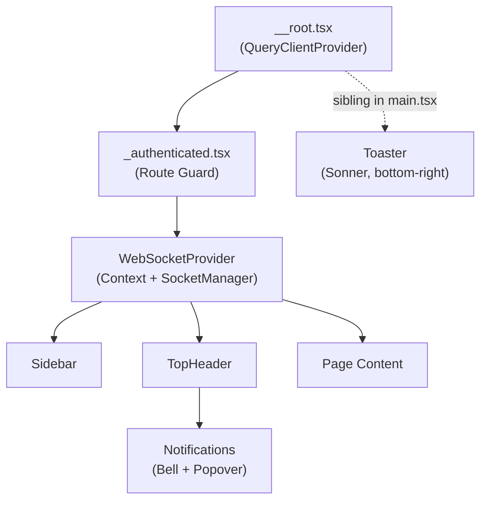
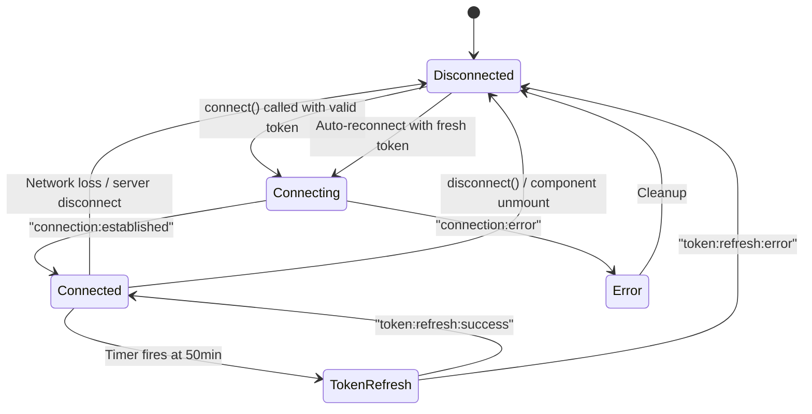
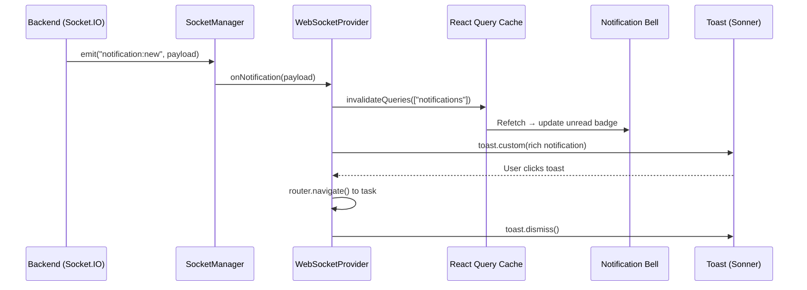
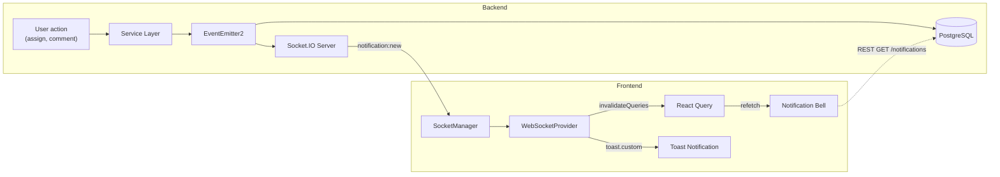
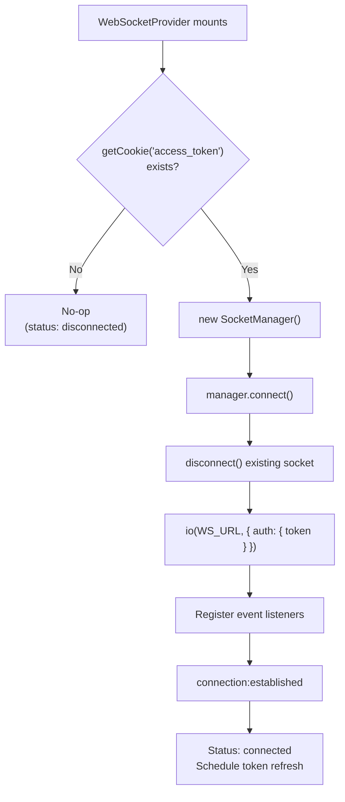
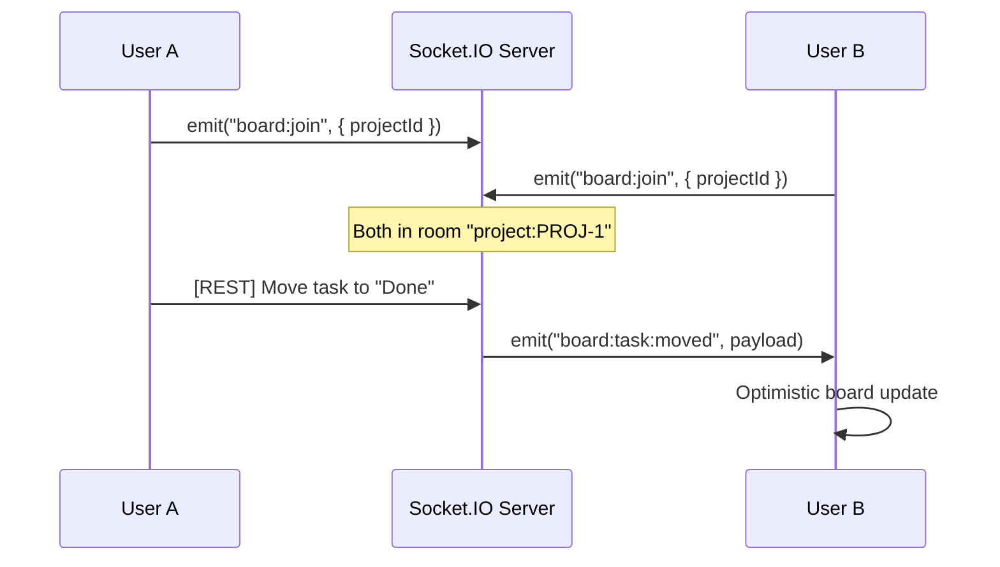

# WebSocket Real-Time Notifications — Frontend Implementation

**Feature:** KAN-74 — WebSocket Integration for Real-Time Updates
**Date:** 2026-04-30
**Author:** Engineering Team
**Stack:** React 19, TypeScript, Socket.IO Client, TanStack Router, TanStack Query, Sonner

---

## 1. Overview

### Summary

This document describes the frontend implementation of real-time notifications via WebSocket (Socket.IO) in the Kanban application. The system establishes a persistent WebSocket connection to the backend, receives push notifications in real time, and surfaces them through interactive toast notifications — eliminating the need for polling.

### Problem It Solves

Prior to this change, the notification system relied entirely on React Query's stale-time-based refetching. Users would only see new notifications after navigating or waiting for a cache invalidation cycle. This created a noticeable delay (up to 5 minutes with default stale time) between an event occurring on the backend and the user being informed.

With WebSocket integration, notifications are delivered instantly. The unread badge updates in real time, and a rich toast appears with contextual information and one-click navigation to the relevant task.

---

## 2. Architecture & Design

### High-Level Structure

The implementation follows a three-layer architecture:

```
┌─────────────────────────────────────────────────┐
│  React Layer (UI)                               │
│  ┌───────────────────┐  ┌────────────────────┐  │
│  │ WebSocketProvider  │  │  Notification Bell │  │
│  │ (Context + Toast)  │  │  (React Query)     │  │
│  └────────┬──────────┘  └────────────────────┘  │
│           │                        ▲             │
│           │  invalidateQueries()   │             │
│           └────────────────────────┘             │
├─────────────────────────────────────────────────┤
│  Service Layer (Framework-Agnostic)             │
│  ┌───────────────────────────────────────────┐  │
│  │  SocketManager                            │  │
│  │  - Connection lifecycle                   │  │
│  │  - Token refresh scheduling               │  │
│  │  - Event routing                          │  │
│  └───────────────────────────────────────────┘  │
├─────────────────────────────────────────────────┤
│  Infrastructure                                 │
│  ┌──────────────┐  ┌──────────────────────┐     │
│  │  Cookie Store │  │  Socket.IO Client    │     │
│  │  (JWT tokens) │  │  (transport layer)   │     │
│  └──────────────┘  └──────────────────────┘     │
└─────────────────────────────────────────────────┘
```

### Component Hierarchy



### Integration Points

| Existing Module | Integration |
|----------------|-------------|
| `_authenticated.tsx` | `WebSocketProvider` wraps the layout — scoped to authenticated routes only |
| React Query (`queryClient`) | `notification:new` events trigger `invalidateQueries({ queryKey: ['notifications'] })` |
| Sonner (`toast`) | Custom toast rendered via `toast.custom()` with navigation support |
| Cookie store (`getCookie`) | JWT access token read directly for Socket.IO handshake auth |
| HTTP client (`tryRefreshTokens`) | Token refresh reused for WebSocket reconnection and scheduled refresh |
| TanStack Router | Toast click navigates to `/projects/$projectId/tasks/$taskId` with optional comment hash |

---

## 3. Technical Decisions

### Decision 1: React Query as Single Source of Truth (No Duplicate State)

**What:** On receiving a `notification:new` WebSocket event, we invalidate React Query caches rather than storing notifications in WebSocket context state.

**Why:** The notification list and unread count are already managed by React Query (`useGetNotifications`, `useGetUnreadCount`). Duplicating this state in the WebSocket context would create two sources of truth that must be kept in sync — a classic bug vector.

**Trade-off:** Each notification triggers a REST refetch. This adds one HTTP request per notification event but guarantees consistency with the server (read status, ordering, pagination).

**Alternative considered:** Storing an in-memory notification array in context (as suggested by the backend integration doc). Rejected because it would require deduplication logic, merge strategies with REST data, and divergent read/unread tracking.

### Decision 2: Provider in `_authenticated.tsx`, Not `__root.tsx`

**What:** `WebSocketProvider` is mounted inside the authenticated layout route, not at the application root.

**Why:**
- WebSocket requires a valid JWT — connecting before authentication would fail
- The `beforeLoad` guard in `_authenticated.tsx` guarantees a token exists
- Unmounting on logout naturally disconnects the socket (no explicit logout handler needed)

### Decision 3: Framework-Agnostic SocketManager Class

**What:** All Socket.IO logic lives in a plain TypeScript class (`SocketManager`) with no React imports.

**Why:**
- Testable without React test utilities — just instantiate and call methods
- Reusable if the app ever adds a non-React entry point (e.g., service worker)
- Clear separation of concerns: React handles UI, SocketManager handles the wire protocol

### Decision 4: Token Access via Cookies (Not React State)

**What:** `SocketManager` reads the access token from cookies via `getCookie('access_token')` rather than receiving it as a React prop/state.

**Why:** Tokens are stored in cookies by the existing `saveTokens()` function in `http-client.ts`. Passing tokens through React state would require lifting state up and adding re-render triggers on token refresh — unnecessary complexity since cookies are already the canonical token store.

### Decision 5: Same-Origin Fallback for WebSocket URL

**What:** `WS_URL` defaults to `window.location.origin` when `VITE_WS_URL` is not set, rather than hardcoding `localhost:1996`.

**Why:** A localhost default would silently break production builds where the env var is missing. Same-origin is the safest default — it works in production (where the WS server is co-located) and fails visibly in dev (prompting the developer to set the env var).

---

## 4. Implementation Details

### File Structure

```
src/
├── config/
│   └── env.ts                          # WS_URL environment config
├── services/
│   └── socket-manager.ts               # Socket.IO client wrapper (framework-agnostic)
├── providers/
│   └── websocket-provider.tsx           # React context + toast rendering
├── hooks/
│   └── use-websocket.ts                # Consumer hook for connection status
└── routes/
    └── _authenticated.tsx              # Provider mount point (modified)
```

### SocketManager — Connection Lifecycle



**Key behaviors:**

- `connect()` calls `disconnect()` first to prevent socket leaks on double-mount
- Reconnection uses Socket.IO's built-in exponential backoff (1s → 30s max, 10 attempts)
- Before each reconnect attempt, `refreshAccessToken()` is called and the socket's `auth` object is updated
- Token refresh is scheduled at 50 minutes (10-minute buffer before 1-hour JWT expiry)

### WebSocketProvider — Notification Flow



### Toast Notification — Type Configuration

Each notification type renders with a distinct icon, color scheme, and content layout:

| Type | Icon | Color | Content |
|------|------|-------|---------|
| `comment_created` | `MessageSquare` | Blue | Task title, actor name, comment preview |
| `comment_mentioned` | `AtSign` | Violet | Task title, actor name, comment preview |
| `task_assigned` | `UserPlus` | Emerald | Task title, actor name |
| `task_updated` | `ArrowRight` | Amber | Task title, from/to status badges |
| Unknown (fallback) | `Bell` | Slate | Task title (graceful degradation) |

### Toast Navigation Logic

Navigation reuses the same pattern as the existing `Notifications` popover component:

1. Extract `projectId` from the current URL pathname (`/projects/:id/...`)
2. Extract `ticketId` from the notification payload (`payload.ticket_id`)
3. For `comment_mentioned` type, append `#comment-{commentId}` hash for scroll-to-comment
4. Navigate via `router.navigate()` to `/projects/$projectId/tasks/$taskId`

If either `projectId` or `ticketId` is missing, the toast is still shown but without the "Click to view" affordance.

### Accessibility

- Toast container has `role="button"`, `tabIndex={0}`, and `onKeyDown` handler for Enter/Space
- Dismiss button uses `stopPropagation` to prevent triggering navigation
- Dismiss button has `aria-label="Dismiss notification"`

---

## 5. Data Flow Diagrams

### End-to-End Notification Flow



### Token Refresh Timeline

```mermaid
gantt
    title JWT & WebSocket Token Lifecycle
    dateFormat mm
    axisFormat %M min

    section JWT
    Access Token Valid       :active, jwt, 00, 60
    Expired Zone             :crit, danger, 60, 70

    section WebSocket
    Connected                :active, ws1, 00, 50
    tryRefreshTokens()       :refresh, 50, 51
    emit token:refresh       :emit, 51, 52
    Connected (new token)    :active, ws2, 52, 110
```



### Provider Initialization



---

## 6. Performance Considerations

### Optimizations Applied

| Technique | Rationale |
|-----------|-----------|
| `useRef` for SocketManager | Avoids recreating the socket connection on re-renders |
| `useRef` for router | Keeps router reference current without adding it as an effect dependency (prevents socket reconnection on navigation) |
| Query invalidation (not direct state) | Leverages React Query's deduplication — multiple rapid notifications only trigger one refetch |
| `transports: ['websocket', 'polling']` | WebSocket preferred for lower latency; HTTP long-polling as automatic fallback |
| Exponential backoff on reconnect | 1s → 2s → 4s → ... → 30s max — prevents thundering herd after server restart |
| `disconnect()` guard in `connect()` | Prevents socket leaks on double-mount (React StrictMode, fast remounts) |
| Single effect with empty deps | Socket connects once on mount, disconnects on unmount — no unnecessary reconnections |

### Potential Bottlenecks

| Concern | Impact | Mitigation |
|---------|--------|------------|
| REST refetch per notification | One HTTP request per `notification:new` event | React Query deduplicates rapid invalidations; typical notification volume is low (< 1/min per user) |
| Toast rendering cost | Each toast mounts a React component tree | Sonner handles virtualization; toasts auto-dismiss after 5 seconds |
| Multiple tabs | Each tab opens its own WebSocket connection | Acceptable for current scale; cross-tab coordination via BroadcastChannel is a future improvement |

---

## 7. Edge Cases & Limitations

### Handled

| Scenario | Behavior |
|----------|----------|
| No access token on mount | `connect()` no-ops; status stays `disconnected` |
| User logs out | Provider unmounts → `disconnect()` cleanup runs |
| Double mount (StrictMode) | `connect()` calls `disconnect()` first, preventing socket leaks |
| Token expires mid-session | Auto-refresh at 50-minute mark via `token:refresh` event |
| Token refresh fails | Server disconnects socket; client auto-reconnects with fresh token from `tryRefreshTokens()` |
| Network drops | Socket.IO auto-reconnects with exponential backoff (up to 10 attempts) |
| Unknown notification type | Fallback config (`Bell` icon, slate color) prevents crash |
| Toast clicked without projectId | Toast renders without "Click to view" hint; no navigation attempted |
| Keyboard-only users | Toast has `role="button"`, `tabIndex={0}`, Enter/Space handlers |

### Known Limitations

| Limitation | Impact | Workaround |
|-----------|--------|------------|
| No offline notification queue | Notifications missed during disconnect are not recovered | Planned: fetch missed notifications via REST on `reconnect` event |
| No duplicate detection | Reconnect + query refetch could briefly show stale data | React Query's stale-while-revalidate handles this gracefully |
| No cross-tab coordination | Each tab shows its own toasts independently | Future: `BroadcastChannel` API for single-tab toast delivery |
| Toast navigation requires projectId in URL | If user is on `/dashboard` (no project context), toast click does nothing | Future: include `project_id` in notification payload from backend |
| Effect runs once (empty deps) | If cookies are cleared externally while mounted, socket keeps the old token | Token refresh at 50min mitigates; full fix would require a cookie observer |

---

## 8. Future Improvements

### Phase 2: Real-Time Board Collaboration



**Required changes:**
- Add `board:join` / `board:leave` events to `SocketManager`
- New `useBoardSync()` hook for real-time column/task updates
- Optimistic UI with server reconciliation

### Other Improvements

| Improvement | Description | Priority |
|------------|-------------|----------|
| Missed notification recovery | Fetch `GET /notifications?is_read=false` on `reconnect` event | High |
| Cross-tab deduplication | Use `BroadcastChannel` API to show toast in only one tab | Medium |
| Notification sound | Play audio on `notification:new` with user preference toggle | Low |
| Read receipts via WebSocket | Emit `notification:read` instead of REST PATCH for faster UX | Medium |
| Presence indicators | Show online/offline status of team members on the board | Low |
| Connection status UI | Display a small indicator (green dot) showing WebSocket status | Low |
| Typing indicators | Show "X is typing..." in comment threads | Low |

---

## Appendix: Event Reference

### Server → Client

| Event | Payload | When |
|-------|---------|------|
| `connection:established` | `{ userId: string }` | Handshake auth succeeds |
| `connection:error` | `{ message: string }` | Handshake auth fails |
| `notification:new` | `{ type, actorId, entityType, entityId, payload, createdAt }` | New notification for this user |
| `token:refresh:success` | `{}` | Token refresh accepted |
| `token:refresh:error` | `{ message: string }` | Token refresh rejected |

### Client → Server

| Event | Payload | When |
|-------|---------|------|
| `token:refresh` | `{ token: string }` | Client sends a new JWT before the current one expires |
